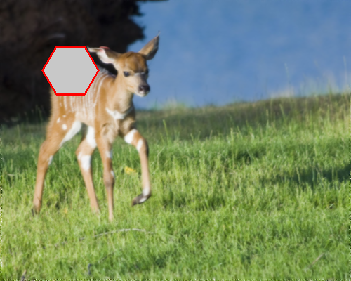
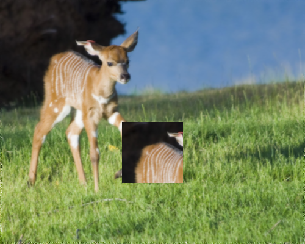
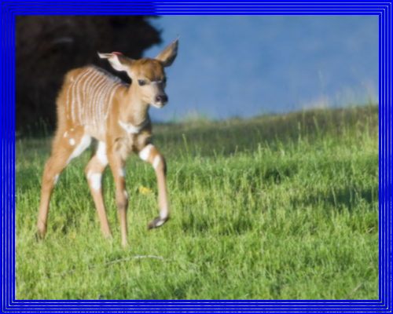
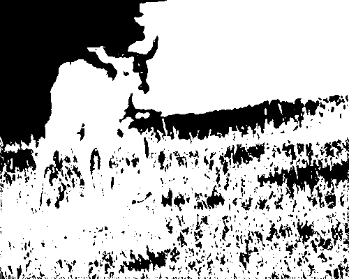
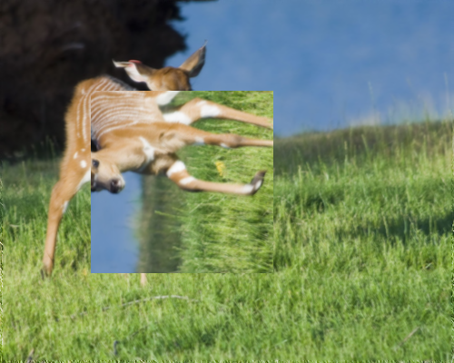
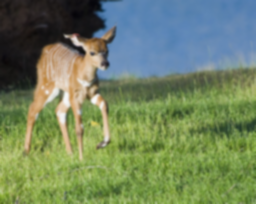
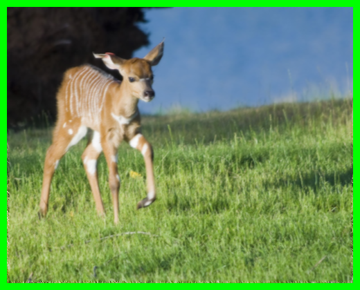
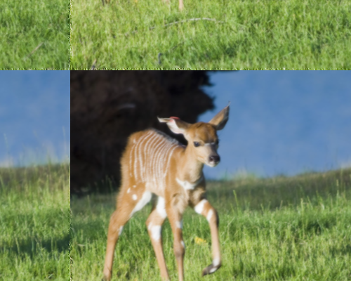

# Обработка BMP изображений

## Описание проекта
Данный проект реализует программу для обработки BMP-изображений, программа предоставляет набор функций для манипуляции изображениями:
- **Рисование правильного шестиугольника.** Возможность задать координаты центра, радиус, толщину линий, цвет и (опционально) заливку.
- **Копирование заданной области.** Копирование области с указанием координат источника и места вставки.
- **Замена цвета.** Возможность заменить один цвет на другой по заданным параметрам.
- **Рисование орнамента.** Построение рамки-узора с выбором паттерна (прямоугольник, круг, полукруги) и настройкой толщины и цвета.
- **Дополнительные операции (defence).** Бинаризация изображения, сжатие, диагональное зеркальное отражение, размытие, добавление внешнего орнамента и сдвиг изображения.

Программа реализована с использованием командной строки (CLI) и функции `getopt`, что позволяет удобно передавать все необходимые параметры.

## Структура проекта
- **main.c** – Точка входа; разбор аргументов командной строки и вызов соответствующих функций.
- **bmp.h / bmp.c** – Функции для работы с BMP-файлами (чтение, запись, вывод информации).
- **drawing.h / drawing.c** – Функции для рисования геометрических фигур (шестиугольник, круг, линии, орнамент).
- **operations.h / operations.c** – Функции для копирования областей и замены цветов.
- **options.h / options.c** – Обработка опций командной строки, связанных с цветами.
- **utils.h / utils.c** – Вспомогательные функции (например, сравнение цветов, проверка диапазона значений).
- **defence.h / defence.c** – Дополнительные функции обработки изображения (бинаризация, сжатие, зеркальное отражение, размытие, сдвиг и внешний орнамент).
- **cw_metoda.pdf** – Методическое пособие к курсовой работе.

## Обработка ошибок

Утилита содержит продуманную систему обработки ошибок, которая обеспечивает стабильную и надёжную работу программы. Проверки выполняются на следующих этапах:

- Проверка корректности аргументов командной строки (включая недостающие параметры, неверные форматы и дублирующие действия);
- Проверка допустимости значений (например, цвета в диапазоне 0–255, положительный радиус и толщина);
- Контроль совпадения входного и выходного имени файла — запрещено использовать один и тот же файл одновременно для чтения и записи;
- Проверка успешности выделения памяти и загрузки изображения из файла BMP;
- Обработка некорректных координат и выхода за пределы изображения при выполнении операций;
- Проверка на попытку одновременного выполнения нескольких несовместимых режимов.

При возникновении ошибок программа выводит диагностические сообщения и завершает выполнение с соответствующим кодом выхода (например, `exit(41)`).

## Требования
- **Компилятор:** GCC (программа компилируется без ошибок на GCC 7.5.0 и выше).
- **Система сборки:** Make (используйте прилагаемый Makefile).
- **Исходное изображение:** Для демонстрации работы используется файл `deer.bmp`.

## Сборка и установка
1. Склонируйте репозиторий или скопируйте все файлы проекта в одну директорию.
2. Откройте терминал и перейдите в директорию проекта.
3. Выполните команду сборки:
   ```bash
   make
   ```
   В результате будет создан исполняемый файл (например, `coursework`).

## Использование
Утилита запускается из командной строки с использованием различных флагов и параметров. Пример вызова:

Для получения списка всех доступных параметров используйте флаг:
```
./coursework --help
```

```bash
./coursework --input deer.bmp --output out.bmp --hexagon --center 100.100 --radius 40 --thickness 3 --color 255.0.0 --fill --fill_color 200.200.200
```




### Дополнительные примеры:

**Копирование части изображения:**
```bash
./coursework --input deer.bmp --output out.bmp --copy --left_up 50.50 --right_down 150.150 --dest_left_up 200.200
```


**Наложение прямоугольного орнамента:**
```bash
./coursework --input deer.bmp --output out.bmp --ornament --pattern rectangle --thickness 2 --color 0.0.255 --count 5
```



**Бинаризация изображения:**
```bash
./coursework --input deer.bmp --output out.bmp --binarization --threshold 300
```



**Зеркальное отражение области по диагонали:**
```bash
./coursework --input deer.bmp --output out.bmp --diag_mirror --left_up 30.30 --right_down 100.100
```



**Размытие изображения (окно 5x5):**
```bash
./coursework --input deer.bmp --output out.bmp --blur --size 5
```



**Добавление внешнего орнамента:**
```bash
./coursework --input deer.bmp --output out.bmp --outside_ornament --thickness 10 --color 0.255.0
```



**Сдвиг изображения по оси X на 20 пикселей:**
```bash
./coursework --input deer.bmp --output out.bmp --shift --step 100 --axis xy
```



**Oстальные команды и их описание можно посмотреть с помощью утилиты --help. (./coursework --help)**

## .gitignore (рекомендуемый)
```
*.o
*.bmp
coursework
```

Автор: Михаил Щеглов
